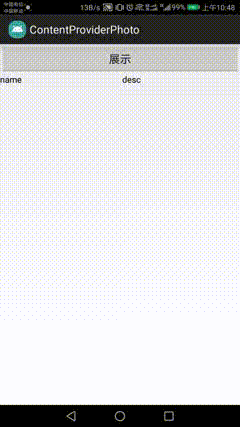

#     ContentProviderPhoto
####  ContentProvider获取手机中的图片并实现删除功能

#### 遇到的一个问题：当手机有SD卡的时候使用MediaStore.Images.Media.EXTERNAL_CONTENT_URI来获取存储在SD卡上的图片的Uri；没有SD卡的时候使用MediaStore.Images.Media.INTERNAL_CONTENT_URI来获取存储在内部存储器上的图片的Uri
###### 注意：本Demo基于Android Studio3.0开发