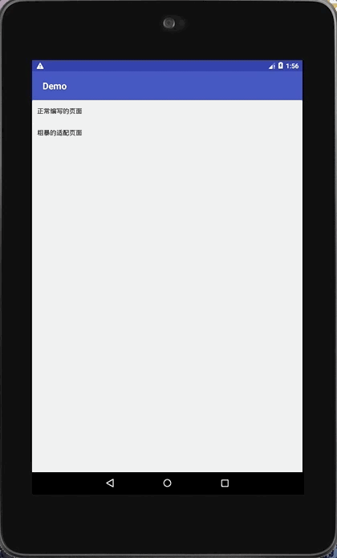

#socket实现简单的字符串聊天功能


效果图gif

##这是一种新颖的屏幕适配方案，宏阳大神的autolayout停止维护，就采用了这种屏幕适配方案

  //连接ip地址 可以通过以下代码查看当前 IP 地址，记住在网络适配里关掉其他的连接，只保留当前连接

  //注意关掉防火墙，关闭杀毒软件


  ```
  代码写这里
  ```


方案分析见[一种粗暴快速的Android全屏幕适配方案](http://www.jianshu.com/p/b6b9bd1fba4d)。

---------

使用姿势：

- 核心。使用冷门的pt作为长度单位，按照上述想法将其重定义为与屏幕大小相关的相对单位，不会对dp等常用单位的使用造成影响。

- 绘制。编写xml时完全对照设计稿上的尺寸来编写，只不过单位换为pt。假如设计图宽度为200，一个控件在设计图上标注的长度为3，只需要在初始化时定义宽度为200，绘制该控件时长度写为3pt，那么在任何大小的屏幕上该控件所表现的长度都为屏幕宽度的3/200。如果需要在代码中动态转换成px的话，使用`TypedValue.applyDimension(TypedValue.COMPLEX_UNIT_PT, value, metrics)`。

- 预览。实时预览时绘制页面是很重要的一个环节。以1334x750的设计图为例，为了实现于正常绘制时一样的预览功能，创建一个长为1334磅，宽为750磅的设备作为预览，经换算约为21.5英寸(`(sqrt(1334^2+750^2))/72`)。预览时选择这个设备即可。


- 代码处理。(代码比较简单，所以你也可以不使用本依赖自己处理)
    在build.gradle中加入依赖：
    ```groovy
    compile 'com.bulong.rudeness:rudeness:latest.release@aar'
    ```
    在Application的onCreate中引用：
    ```java
    //设计图标注的宽度
    int designWidth = 750;
    new RudenessScreenHelper(this, designWidth).activate();
    ```

这样绘制出来的页面就跟设计图几乎完全一样，无论大小屏上看起来就只是将设计图缩放之后的结果。

-------
SDK API Refrences：
```java
public class RudenessScreenHelper {

    /**
     * 转换dp为px
     * @param context context
     * @param value 需要转换的dp值
     * @return px值
     */
    public static float dp2px(Context context, float value);

    /**
     * 转换pt为px
     * @param context context
     * @param value 需要转换的pt值，若context.resources.displayMetrics经过resetDensity()的修改则得到修正的相对长度，否则得到原生的磅
     * @return px值
     */
    public static float pt2px(Context context, float value);

    /**
     * 构造方法
     * @param application application
     * @param width 设计稿宽度
     */
    public RudenessScreenHelper(Application application, float width);

    /**
     * 激活本方案
     */
    public void activate();

    /**
     * 恢复系统原生方案
     */
    public void inactivate();
}
```

-------
**FAQ**

**若存在webview导致适配失效的问题**

可以先继承WebView并重写`setOverScrollMode(int mode)`方法，在方法中调用super之后调用一遍`RudenessScreenHelper.resetDensity(getContext(), designWidth)`规避

**若存在dialog中适配失效的问题**

可以在dialog的oncreate中调用一遍`RudenessScreenHelper.resetDensity(getContext(), designWidth)`规避

**旋转屏幕之后适配失效**

可以在onConfigurationChanged中调用`RudenessScreenHelper.resetDensity(getContext(), designWidth)`规避

**特定国产机型ROM中偶先fragment失效**

可以在fragment的onCreateView中调用`RudenessScreenHelper.resetDensity(getContext(), designWidth)`规避

-------
关于demo：

- *正常编写的页面* 是按照dp来编写的页面
- *粗暴适配的页面* 是按照本方案编写的页面

在多种不同屏幕大小的真机与虚拟机下运行项目，可见*粗暴适配的页面*表现几乎一致，而*正常编写的页面*在大屏与小屏之间看起来差异较大。

