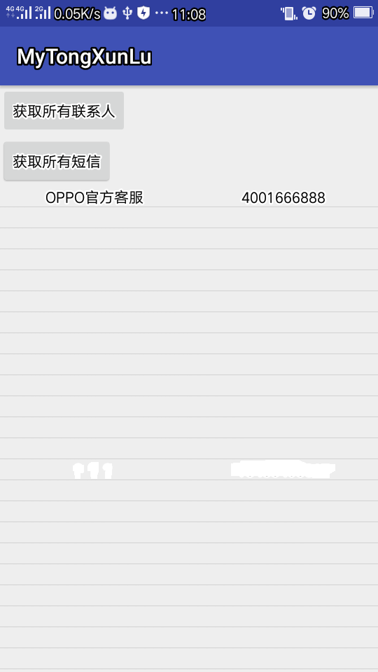

#获取手机通讯录  涉及隐私问题，只给大家展示一个手机号
效果图gif

#实现手机通讯录的核心代码是

###步骤一:
///拿到内容访问者
getContentResolver();
//拿到相关的URI地址
  Uri uri=Uri.parse("content://com.android.contacts/raw_contacts");
###步骤二:
//获取联系人的ID和Name

 while(cs.moveToNext()){

            int id=cs.getInt(cs.getColumnIndex("_id"));
            String name=cs.getString(cs.getColumnIndex("display_name"));
            //得到这个id的所有数据（data表）
            Uri uri1=Uri.parse("content://com.android.contacts/raw_contacts/"+id+"/data");
            Cursor cs2=cr.query(uri1,null,null,null,null,null);
            Map<String,String>  maps=new HashMap<>();//实例化一个map
            while ( cs2.moveToNext()){
                //得到data这一列 ，包括很多字段
                String data1=cs2.getString(cs2.getColumnIndex("data1"));
                //得到data中的类型
                String type=cs2.getString(cs2.getColumnIndex("mimetype"));
                String str=type.substring(type.indexOf("/")+1,type.length());//截取得到最后的类型
                if("name".equals(str)){//匹配是否为联系人名字
                    maps.put("name",data1);
                }if("phone_v2".equals(str)){//匹配是否为电话
                    maps.put("phone",data1);
                }
                Log.i("test",data1+"       "+type);
            }
            mp.add(maps);//将map加入list集合中

